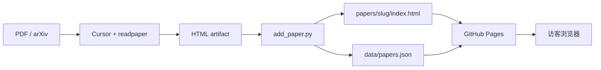

# Paper Reading

把 [readpaper](https://github.com) skill 生成的 HTML 论文解读，整理成一个可浏览的静态网站，托管在 **GitHub Pages**。

## 架构



| 路径 | 作用 |
|------|------|
| `index.html` | 首页：从 `data/papers.json` 渲染论文卡片 |
| `papers/<slug>/index.html` | 单篇讲解（readpaper 正文 + 站点导航） |
| `data/papers.json` | 目录元数据（标题、日期、标签、链接） |
| `data/site.json` | 站点标题；**`base`** 用于项目页子路径 |
| `assets/site.css` | 首页样式 + readpaper 图表样式（`.readpaper-body`） |
| `scripts/add_paper.py` | 把 readpaper HTML 写入站点并更新目录 |

**设计原则：** readpaper 继续输出「自包含」的 HTML 片段（`h1`、章节、`.diagram` 面板）；站点只加一层导航和统一 CSS，不改动正文结构，避免和 skill 规范冲突。

## 本地预览

```bash
cd Paper_Reading
python3 -m http.server 8080
# 打开 http://localhost:8080
```

## 发布新论文（工作流）

1. 在 Cursor 里用 readpaper 解读论文，得到 HTML（保存为 `downloads/xxx.html` 或从对话里复制）。
2. 运行脚本入库：

```bash
python3 scripts/add_paper.py ~/path/to/paper.html \
  --title "Attention Is All You Need" \
  --slug attention-2017 \
  --date 2026-05-22 \
  --tags "nlp,transformer" \
  --arxiv "https://arxiv.org/abs/1706.03762" \
  --tldr "用自注意力替代 RNN，成为现代 LLM 的基础架构。"
```

3. 提交并 push：

```bash
git add papers/ data/papers.json
git commit -m "Add explainer: attention-2017"
git push
```

4. GitHub Actions 会自动部署 Pages（见 `.github/workflows/pages.yml`）。

## 部署到 GitHub Pages

### 1. 创建仓库并推送

```bash
git init
git add .
git commit -m "Initial Paper Reading site"
git remote add origin git@github.com:YOUR_USER/Paper_Reading.git
git push -u origin main
```

### 2. 开启 Pages

仓库 **Settings → Pages → Build and deployment**：

- **Source:** 选 **GitHub Actions**（不要选 Deploy from a branch）
- 若 Actions 里 `Deploy GitHub Pages` 失败并提示 “Get Pages site failed”，说明 Pages 尚未启用；工作流已带 `enablement: true`，重新 push 一次通常可自动开启。也可手动在 Settings → Pages 里把 Source 改为 GitHub Actions 后，到 **Actions** 页重新运行工作流。

首次成功部署后等 1–3 分钟，访问：

- 用户站：`https://YOUR_USER.github.io/`（仅当仓库名为 `YOUR_USER.github.io`）
- **项目站（推荐）：** `https://YOUR_USER.github.io/Paper_Reading/`

### 3. 项目站必须设置 base

编辑 `data/site.json`：

```json
{
  "title": "Paper Reading",
  "tagline": "...",
  "base": "/Paper_Reading"
}
```

`base` 填仓库名（首尾斜杠会自动处理）。然后重新运行 `add_paper.py` 生成论文页，或手动检查 `papers/*/index.html` 里返回首页的链接。

## 与 readpaper 的配合建议

在 Cursor 里读完论文后，可以让 Agent：

1. 把 HTML 保存到项目根目录的 `inbox/`（可自行创建）；
2. 执行 `add_paper.py` 并填写 `--arxiv` / `--tldr`；
3. 你 review 后 `git push`。

也可以在项目 `.cursor/rules` 里写一条规则：「生成 readpaper HTML 后，默认调用 `scripts/add_paper.py`」。

## 许可

讲解内容由你通过 readpaper 生成；站点骨架可自由修改。
